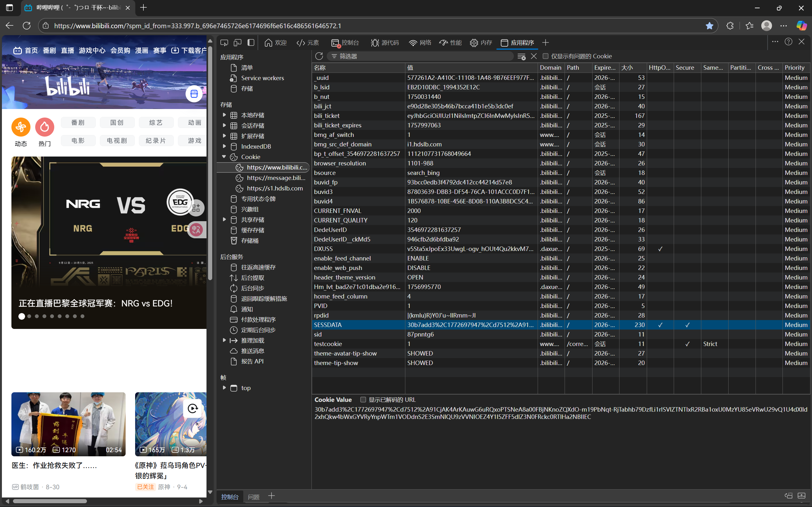

# 前端招新题目2回答

## 1.开发者工具基础面板了解
* **元素面板** 

  查看和编辑网页的HTML结构与CSS样式，可实时修改元素属性、调整样式并即时预览效果~~最好玩的~~  
* **控制台**  

  执行JavaScript代码片段、查看代码运行日志、调试错误信息，是前端调试的核心工具  
* **源代码**  

  查看网页加载的所有文件，支持设置断点、单步调试JS代码，定位逻辑错误。  
* **网络面板**  
监控网页所有网络请求，显示请求的URL、状态码、响应时间、响应数据，用于优化加载速度  
* **应用面板**  

  管理网页的本地存储数据，包括Cookie、LocalStorage、SessionStorage、IndexedDB，还可查看网页缓存、Service Worker等，常用于调试存储相关问题，*问题3主要也靠这个*  
* **性能面板**  

  记录网页从加载到交互的全过程性能数据（如CPU占用、帧率、页面渲染时间），生成性能分析报告，帮助定位页面卡顿、加载缓慢等性能瓶颈  
**PS:部分内容为查阅资料所得** 

## 2.成为百万up主~~bushi~~  

## 3.强大的Cookie
* **什么是Cookie**  

  **豆包说**：“Cookie（小型文本文件）是网站服务器发送并存储在用户设备（电脑、手机等）上的少量数据，主要用于记录用户身份、偏好、浏览状态等信息，让后续访问更便捷。  
简单来说，Cookie就像网站给用户的“电子身份证”：  
首次访问时，网站生成这个“身份证”并存在你设备上；  
下次再进同一网站，它会读取“身份证”，快速识别你（比如免重复登录）、记住你的设置（比如字体大小、深色模式）。  
Cookie通常是安全的，且数据量很小（一般几KB），但也可通过浏览器设置查看、删除或禁用。”  

  **窃以为**：“Cookie就是浏览器偷偷记录下来的用户的部分使用数据，也就是相当于它对用户的一种记忆，会自动沿用上次的使用偏好和账户设置等。”

* **如何查看Cookie**  

  **以B站为例**  
1. 打开B站主站，使用账号密码登录。  
2. 按下键盘上的F12打开浏览器开发者模式。  
3. 在开发者工具界面中，找到并点击“应用程序”。  
4. 点击“Cookies”，选择“https://www.bilibili.com”。  
5. 此时可以看到B站相关的Cookie信息，找到如“SESSDATA”“DedeUserID”“bili_jct”字样，其对应的“值”就是相应的Cookie内容。  
如图：

* **如何使用Cookie登入网站(B站)**

1. 打开B站官网，按下键盘上的F12打开浏览器开发者模式。  
2. 在开发者工具界面中，找到并点击“应用程序”，然后点击“Cookies”，选择“https://www.bilibili.com”。  
3. 右键点击需要修改的Cookie，选择“编辑”，将获取的Cookie内容对应填写到“名称”和“值”的字段中，点击“完成”，刷新网页即可完成登录。  
**PS：这种做法仍会有部分功能无法使用，完整方法较为复杂，建议进一步学习**

### 图片如无法查看，已额外放在了仓库内，请自行查看